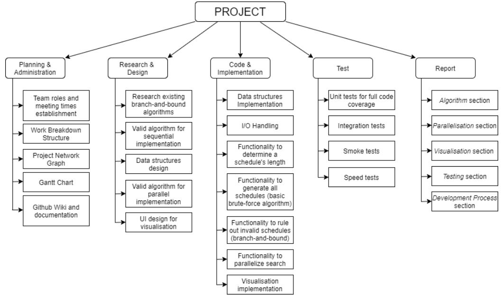
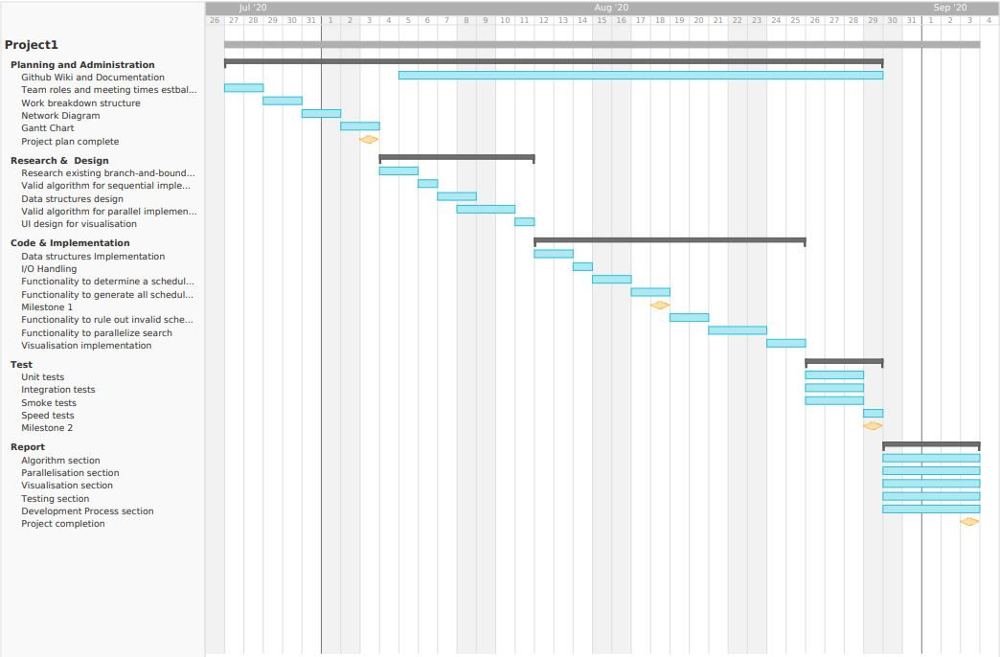

# Project Management 🎛

**Milestones**

For this project, there are two milestones we must accomplish before submitting in a
final working solution.
The first milestone is all about getting a valid solution done. More info can be found
[here](https://github.com/SoftEng306-2020/project-1-project-1-team-11/blob/wiki-readme/wiki/Milestone1.md).   
The second milestone requires us to create an optimal schedule, have a parallel
version of the search, and a live visualisation of the search. More info can be found
[here](https://github.com/SoftEng306-2020/project-1-project-1-team-11/blob/wiki-readme/wiki/Milestone2.md).

**Waterfall**

This project will be completed following the waterfall model. 

[Requirements] -> [Design] -> [Implementation] -> [Testing] -> [Maintenance]

**Work Breakdown Structure**

A WBS diagram was developed to break our project into smaller tasks. This way, we could set
goals easily, delegate tasks, and have a visual representation of what we need to do.
From our WBS diagram, we could derive a project network, and a Gantt chart to manage the 
overall workflow of our project and set timeframes. 

