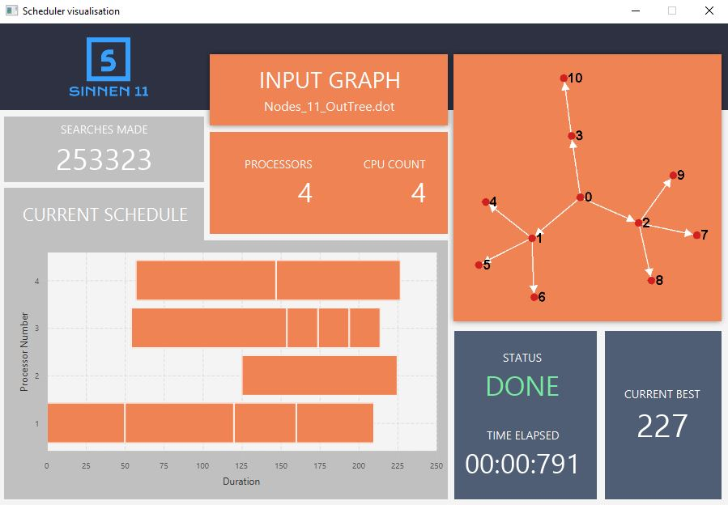

# Visualisation Design  👀
Scenebuilder was used to create mid fidelity protoypes as it has easy drag and drop
features that allowed us to come up with designs quickly.
Once we landed on a design we were happy with, we saved it as an fxml file and started
implementing the updates.

## Initial Design 👶

- Boxes were used to separate information and give it a modern feel.
- Logo was easily viewable at the top
- Cleaner

**Problems:**
- Wanted the current schedule section to be horizontal so it is easier to view.
- Make input graph image slightly larger to accommodate for larger graphs.

## Second iteration

- Layout rearranged
- Current schedule and input graph made bigger
- Space better utilized

**Problems:**
- Current best font too large
- Time elapsed can be easier to read
- Colours a bit distracting

## Final iteration

- Better colour palette
- Better time format
- Current best will not overflow for larger numbers
